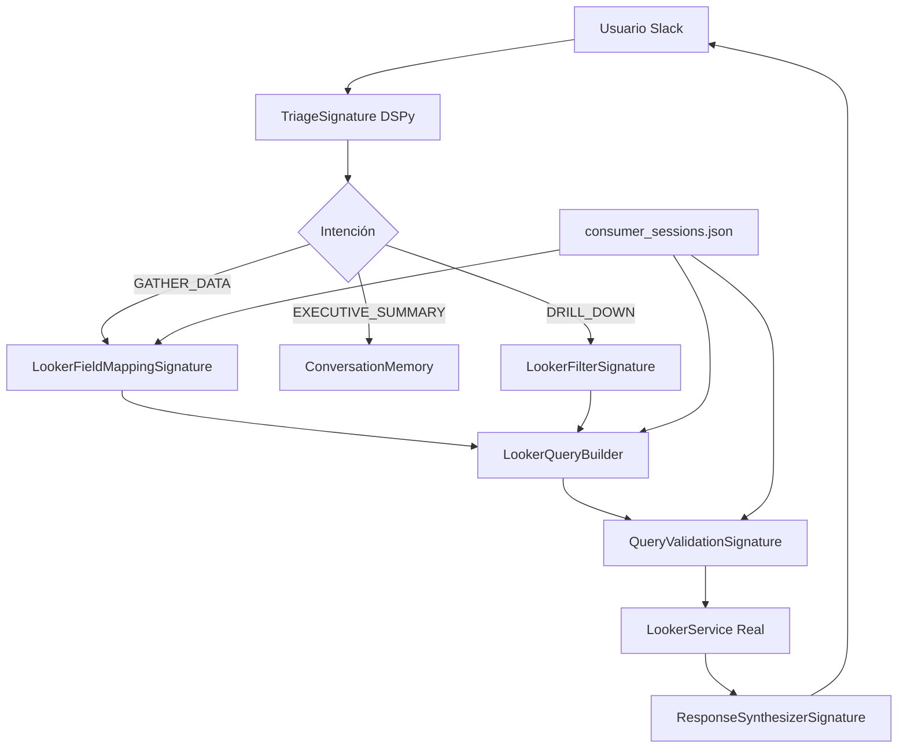

# Plan de Implementación - Conversational Looker Agent

## 🎯 Estado Actual - FUNCIONAL ✅
**Fecha última actualización: 2025-09-25**

### ✅ **LO QUE ESTÁ FUNCIONANDO HOY:**
- 🔌 **Slack Integration**: Bot responde a mentions (@bot) y DMs correctamente
- 🔐 **Security**: Solo responde al ALLOWED_USER_ID configurado
- 💬 **Basic Chat**: Respuestas simples funcionales (hello, help, data commands)
- 🛑 **Graceful Shutdown**: Ctrl+C termina la app correctamente
- ⚙️ **Environment**: Todas las variables configuradas y funcionando

### ✅ **INTEGRACIÓN LOOKER REAL COMPLETA:**
- 🔗 **LookerService**: Migrado de boats_agent_base, autenticación real
- 📊 **Schema JSON**: consumer_sessions_explore.json cargado (61 dimensions, 1 measures)
- 🏗️ **QueryBuilder**: Inicializado con schema real
- 🔧 **Configuration**: Looker API credentials configuradas (MOCK_LOOKER_API=false)

### ✅ **DSPy PIPELINE PREPARADO:**
- 🧠 **ConversationalAgent**: Inicializado correctamente con 8 intenciones
- 💾 **Memory System**: ConversationMemory funcionando
- 🤖 **OpenAI Integration**: API key configurada, DSPy modules ready
- 📋 **Signatures**: Todas las signatures DSPy implementadas

## 🗂️ Arquitectura Integrada Objetivo



## 🚀 PRÓXIMOS PASOS INMEDIATOS

### **✅ COMPLETADO - Fase 1: Base Infrastructure (2025-09-25)**
- ✅ **LookerService Real**: Migrado e integrado completamente
- ✅ **Schema JSON**: Cargado y parseado correctamente
- ✅ **Slack Integration**: Funcionando con respuestas básicas
- ✅ **Environment Setup**: Todas las credenciales configuradas
- ✅ **DSPy Infrastructure**: Pipeline completo preparado

---

### **✅ COMPLETADO - Fase 2.1: DSPy Pipeline Integrado**

#### **✅ Paso 2.1: ConversationalAgent Reactivado en Slack**
- ✅ **CLI Testing**: Preparado para probar DSPy con `python app.py`
- [ ] **Intent Detection**: Verificar que TriageSignature funciona con OpenAI
- [ ] **Basic DSPy Flow**: "hello" → FRIENDLY_CONVERSATION → response
- [ ] **Test**: Agent.process_query() funciona sin errores

#### **✅ Paso 2.2: DSPy Integrado en SlackService**
- ✅ **Reemplazado simple responses** en `slack_service1.py`:
  ```python
  # ✅ IMPLEMENTADO:
  # Cambió de:
  # formatted_response = simple_text_logic()
  # A:
  response_data = await self.agent.process_query(clean_text, user_id)
  formatted_response = self._format_response_for_slack(response_data)
  ```
- ✅ **Mejorado _format_response_for_slack**: Soporte para todos los intent types
- [ ] **Test cada intención**:
  - `@bot hello` → FRIENDLY_CONVERSATION
  - `@bot help` → AGENT_CAPABILITIES
  - `@bot show me data` → GATHER_DATA_FROM_LOOKER

---

### **🎯 PRÓXIMA SESIÓN - Fase 2.2: Validar DSPy Pipeline**

#### **Paso 2.3: Validar Pipeline Completo (Sin Looker API aún)**
- [ ] **Intent routing**: Verificar que cada intent llega al handler correcto
- [ ] **Memory system**: Probar que mantiene contexto entre mensajes
- [ ] **Response synthesis**: Respuestas naturales y coherentes
- [ ] **Error handling**: Manejo robusto de errores DSPy

---

## **🚨 FIX CRÍTICO IDENTIFICADO - QueryBuilder**

### **Problema Actual:**
```
Built query: {'dimensions': [], 'measures': [], 'sorts': [], 'filters': {}, 'limit': 10}
Error 422: "view is not present"
```

### **Causa Raíz:**
1. **ConversationalAgent** llama `build_query_from_intent(user_query, {})` con parámetros vacíos
2. **QueryBuilder** no puede extraer nada de parámetros vacíos → genera query inválida
3. **Falta "view"** en la query (Looker lo requiere)
4. **No hay fallback** cuando no detecta dimensions/measures

### **🔧 FIX EXACTO A IMPLEMENTAR:**

#### **Archivo:** `src/looker/query_builder.py`

**1. Agregar "view" al query base:**
```python
# En build_query_from_intent(), línea 32-40, cambiar:
query = {
    "model": self.schema.get("model", "default_model"),
    "explore": self.schema.get("explore", "default_explore"),
    # ...
}
# Por:
query = {
    "model": self.schema.get("model", "default_model"),
    "view": self.schema.get("explore", "default_explore"),  # ← AGREGAR ESTA LÍNEA
    "explore": self.schema.get("explore", "default_explore"),
    # ...
}
```

**2. Implementar fallback robusto al final de build_query_from_intent():**
```python
# Después de línea 49, ANTES del return, agregar:
# Fallback: Si query está vacía, usar query por defecto
if not query.get("dimensions") and not query.get("measures"):
    logger.warning("No dimensions/measures detected, using default query")
    return self._get_default_query_with_view()

return query
```

**3. Crear método _get_default_query_with_view():**
```python
def _get_default_query_with_view(self) -> Dict[str, Any]:
    """Get a default query with required 'view' field."""
    # Usar la primera measure disponible o sessions como fallback
    default_measure = list(self.measures.keys())[0] if self.measures else "consumer_sessions.sessions"

    return {
        "model": self.schema.get("model", "bg"),
        "view": self.schema.get("explore", "consumer_sessions"),  # ← REQUERIDO
        "explore": self.schema.get("explore", "consumer_sessions"),
        "fields": [default_measure],  # ← Al menos 1 field requerido
        "filters": {},
        "sorts": [],
        "limit": 10
    }
```

**4. Actualizar _get_default_query() existente:**
```python
# Reemplazar método existente con:
def _get_default_query(self) -> Dict[str, Any]:
    """Get a default query when building fails."""
    return self._get_default_query_with_view()
```

### **✅ Resultado Esperado:**
- ✅ Queries siempre incluyen "view"
- ✅ Queries siempre tienen al menos 1 field
- ✅ Fallback robusto cuando no hay parameters
- ✅ "gather data" → query válida → respuesta de Looker real

---

### **🔄 FASE 3: Activar Looker API Integration**
> Solo después de que DSPy pipeline funcione completamente

#### **Paso 3.1: Primera Query Real a Looker**
- [ ] **Simple query**: "show me session count" → Looker API real
- [ ] **Response with data**: Formatear datos de Looker en respuesta natural
- [ ] **Error handling**: Manejo de errores de Looker API

#### **Paso 3.2: Queries Complejas**
- [ ] **Dimensional queries**: "sessions by country"
- [ ] **Time-based queries**: "sessions last month"
- [ ] **Top N queries**: "top 5 countries by sessions"

---

## 🎯 **OBJETIVOS FINALES**

### **Criterios de Éxito para Completar el Proyecto:**
- ✅ Conexión estable a Looker API real
- [ ] Mapeo >90% preciso de NL → JSON queries via DSPy
- [ ] Tiempo de respuesta < 5 segundos promedio
- [ ] Manejo robusto de 10+ tipos de consultas diferentes
- [ ] Experiencia conversacional fluida en Slack

### **🧪 Testing Strategy por Fase:**
- **Fase 2**: DSPy pipeline funciona sin Looker
- **Fase 3**: Queries reales a Looker API funcionan
- **Fase Final**: End-to-end user experience completa

### **📋 8 Intenciones DSPy Implementadas:**
1. **GATHER_DATA_FROM_LOOKER**: Queries principales ("show me revenue")
2. **GET_EXECUTIVE_SUMMARY**: Análisis de datos existentes
3. **DRILL_DOWN_ANALYSIS**: Filtros/segmentación
4. **AGENT_CAPABILITIES**: Info sobre el bot
5. **DATA_SOURCE_INFO**: Datos disponibles
6. **FRIENDLY_CONVERSATION**: Saludos, casual
7. **MANAGE_CONVERSATION**: Clear history, reset
8. **OTHER**: Fallback genérico

---

## 🏁 **ESTADO ACTUAL DE ARCHIVOS:**

### **✅ Funcionales:**
- `slack_app.py` - Entry point con shutdown mejorado
- `src/slack/slack_service1.py` - Handlers con responses básicas
- `src/slack/config.py` - Configuración completa
- `src/looker/service.py` - LookerService real migrado
- `src/looker/schema_loader.py` - Schema loading funcionando
- `src/modules/agent/conversational_agent.py` - DSPy pipeline preparado

### **🔧 Listos para activar:**
- Todas las signatures DSPy implementadas
- ConversationalAgent.process_query() preparado
- LookerService con API real configurada
- Schema JSON completo cargado

**🚀 TODO ESTÁ LISTO PARA LA PRÓXIMA SESIÓN: Activar DSPy Pipeline**